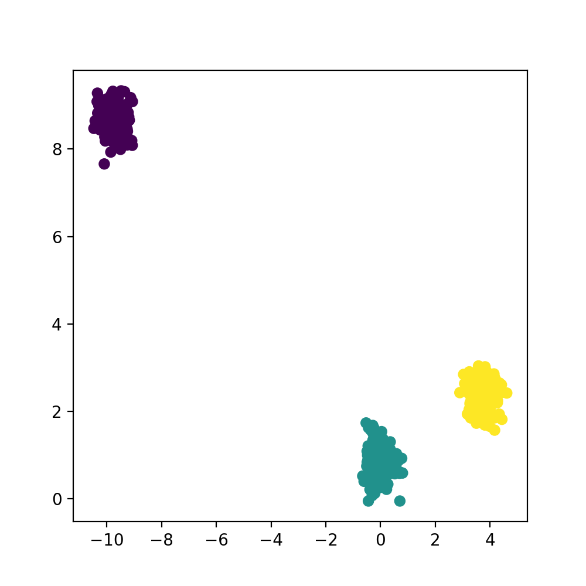
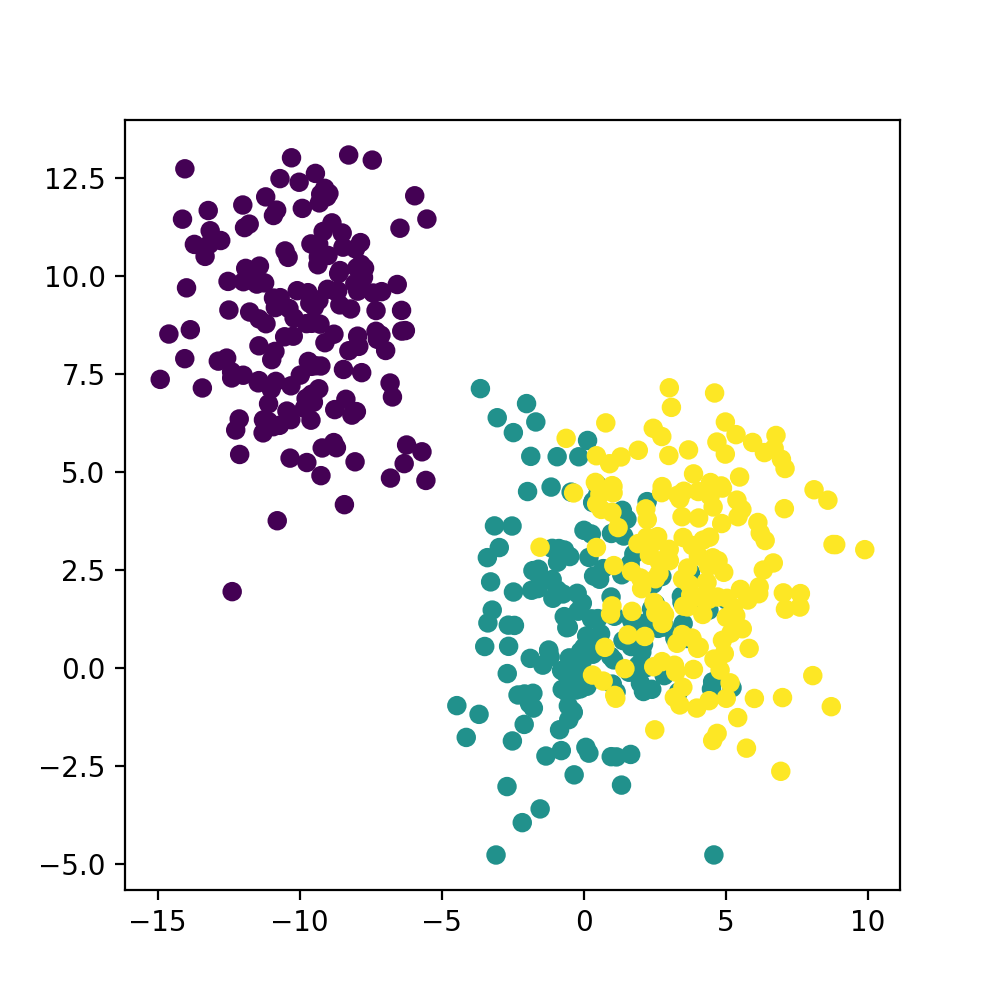
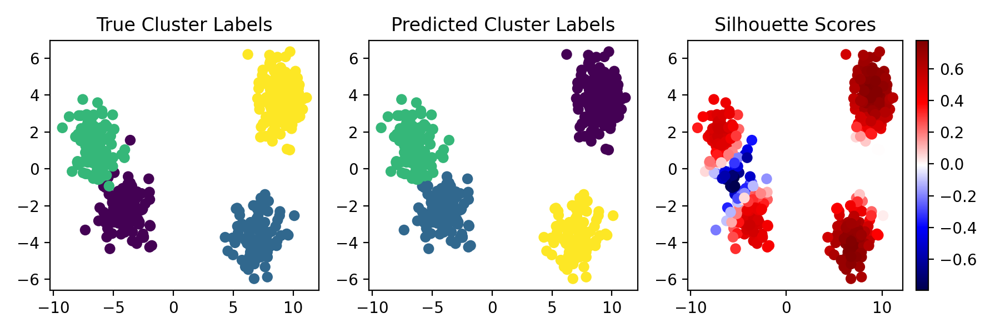

# Project 5
Implementation of KMeans and Silhouette Scoring

# Assignment

## Overview
The goal of this assignment is to implement the k-means clustering algorithm and the silhouette scoring algorithm. 

For a refresher on the kmeans algorithm you can check out [this overview](https://towardsmachinelearning.org/k-means/) or the [wiki](https://towardsmachinelearning.org/k-means/). 

For a refresher on the silhouette scoring algorithm you can check out [this overview](https://tushar-joshi-89.medium.com/silhouette-score-a9f7d8d78f29) which gives a broad overview of the intuition behind the algorithm (though it uses the sklearn implementation while you will need to build your own from scratch) or [the wiki](https://en.wikipedia.org/wiki/Silhouette_(clustering))

Unlike previous assignments where we give a particular bioinformatics use case and problem - we will keep this assignment abstract and operate on matrices of arbitrary sizes (i.e. some random number of observations and some random number of features). The reasoning behind this is that it is sometimes best to consider the scope of your inputs and outputs to an algorithm and not bring in any domain specific logic or naming to the implementation.  

Instead of providing you with a fixed input to the KMeans algorithm I've provided some code to generate a clustered 2D matrix with known labels. Use this as your input and validate your results visually with the plotting functions I've provided. 

Consider the scope of the inputs and how the different parameters of the input data could break the bounds of your implementation.
  * should your model still run if the provided k=0?
  * should your model still run if the number of observations < the provided k?
  * can your model handle very high k? 
  * can your model handle very high dimensionality? what about only a single dimension? 

## API
This implementation __must__ support a fixed and predefined API. Please consider what methods of your implementation should be public and private and denote them using the appropriate underscored style 

```python3
class SomeClass:
  
  def public_method(self):
    """
    """

  def _private_method(self):
    """
    """
```

Your KMeans algorithm will be implemented using a scikit-learn style API (i.e. init/fit/predict) which will require 3 steps to run. 

The intuition behind splitting up the fit/predict methods is that you may want to cluster novel data using the centroids calculated from some initial training set.

Your Silhouette algorithm will be implemented using a scikit-learn style metric API (i.e. init/score) which will require 2 steps to run. 

The intuition behind splitting this up will not be immediately apparent for this silhouette scoring implementation but in the real world there are usually multiple scoring methods you are calculating which would be subclassed from some shared Metric class. 

Building up your models with this in mind will allow for easy integration of subclasses with superclasses down the line if you ever end up implementing them. 

While these methods are the only ones we are _requiring_ I highly recommend you create more private methods for specific subtasks within your implementation. 

### Example Usage
```python3
# instantiation of model with some params
kmeans = KMeans(*args, **kwargs)
silhouette = Silhouette(*args, **kwargs)

# fit the model using some input data
kmeans.fit(input_data)

# predict the labels on some input data
labels = kmeans.predict(input_data)
scores = silhouette.score(labels)
```

## Tasks
[ TODO ] Complete the KMeans class with your implementation of the algorithm
  * complete the `fit` method
  * complete the `predict` method
  * complete the `get_error` method
  * complete the `get_centroid` method

[ TODO ] Complete the Silhouette class with your implementation of the algorithm
  * complete the `score` method

[ TODO ] Unit Testing
  * KMeans Class
  * Silhouette Class

[ TODO ] Packaging
  * pip installable module
  * github actions (install + pytest)

# Getting Started
To get started you will need to fork this repo onto your own github account. Work on your codebase from your own repo and commit changes. I have listed the minimum (and maximum) python module requirements in `requirements.txt` 

## Using Utility Functions
I've built up some utility functions for you to use to test and visualize your implementation of K-Means and Silhouette scoring. There are 3 functions that you can use for these tests and you can read more about how to use them in their docstrings + usage below:

```python3
from cluster import (
  make_clusters, 
  plot_clusters, 
  plot_multipanel)

"""
Cluster Generation
"""

# here we are making tightly clustered data by lowering the scale param
t_clusters, t_labels = make_clusters(scale=0.3) 

# here we are making loosely clustered data by increasing the scale param
l_clusters, l_labels = make_clusters(scale=2) 

# here we are making many clusters by adjusting the `k` param
m_clusters, m_labels = make_clusters(k=10)

# here we are directly controlling the dimensionality of our data 
#   1000 observations 
#   200 features 
#   3 clusters)
d_clusters, d_labels = make_clusters(n=1000, m=200, k=3)


"""
Cluster Visualization
"""
# show the visualization for some clusters and their associated labels
plot_clusters(t_clusters, t_labels)

# show a multipanel visualization of clusters with true labels, predicted labels, and silhouette scores
# you will need to calculate these predicted labels with your kmeans implementation and the scores 
# with your silhouette score implementation
plot_multipanel(t_clusters, t_labels, pred_labels, scores)
```

## Example Visualizations
Here are some examples of visualizations for some tightly and loosely clustered data. 

I've also included an example output for the multipanel visualization

### Tightly Clustered Data


### Loosely Clustered Data


### Multipanel Visualization
> Note that the cluster labels themselves may change after clustering 
> 
> (i.e. expected cluster 0 is not guaranteed to be named cluster 0 after clustering) 



# Grading (Total: 10)
* KMeans Implementation (3)
* Silhouette Implementation (2)
* Correct API (1)
* Unit Tests (2)
* Pip Installable / Actions (2)
